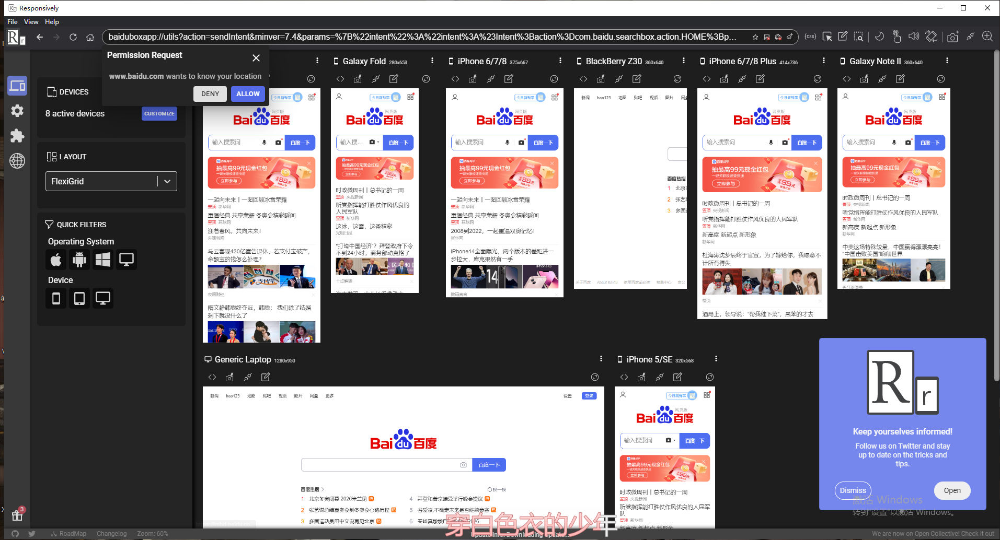

<!--
 * @Author: lcz
 * @Date: 2022-02-21 14:28:19
 * @LastEditTime: 2022-03-07 22:39:18
 * @LastEditors: Please set LastEditors
 * @Description: 打开koroFileHeader查看配置 进行设置: https://github.com/OBKoro1/koro1FileHeader/wiki/%E9%85%8D%E7%BD%AE
 * @FilePath: \lcz_document\docs\Plaything\client.md
-->
## ResponsivelyApp 移动端多屏幕同一尺寸适配

## iTunes

## pano2vr

## Ganache

## 极光（佛跳墙）

## appupLoader

## Snipaste-2.5.6-Beta-x64
* 屏幕截屏预览

## 佳伟文档
[佳伟文档](https://www.coderljw.ga/)