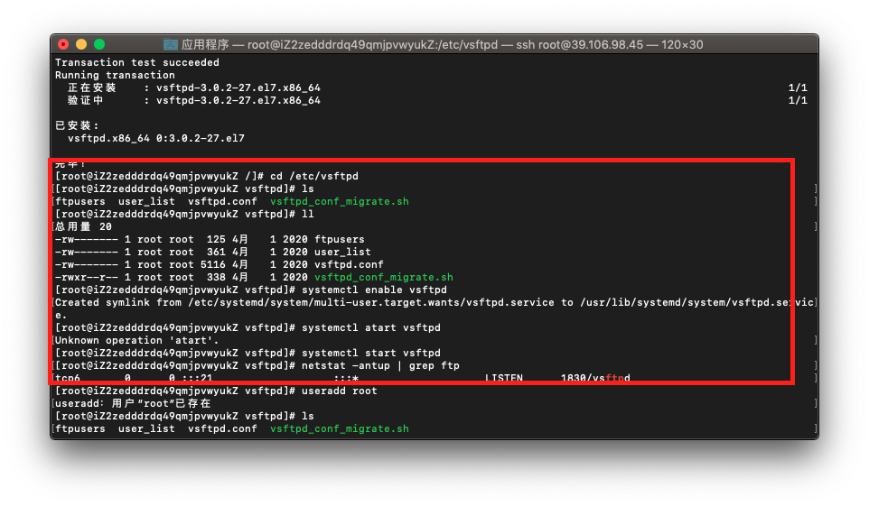

<!--
 * @Author: your name
 * @Date: 2021-10-08 17:17:05
 * @LastEditTime: 2021-10-08 17:57:25
 * @LastEditors: Please set LastEditors
 * @Description: In User Settings Edit
 * @FilePath: \lcz_document\docs\baseuse\md.md
-->
## 1.#使用
#代表h1~h6

## 2.无序列表*-+的使用
* 1
* 2
* 3 
- 1
- 2
- 3
+ 1
+ 2
+ 3

## 3.有序列表

1. 列表1
2. 列表2
3. 列表3

## 4.区块引用

* 无序列表1
  > 这是XX
* 无序列表2
  > 这是xxx2

>## 4.1区块引用
>
> * 无序列表1
>  > 这是XX
> * 无序列表2
>  > 这是xxx2

## 5.分割线多种实现方式

---------------
**********
- - -
* * *

## 6.1外部链接 行内
[百度](https://www.baidu.com)跳转

## 6.2 整个链接
[整个都是百度](https://www.baidu.com)

## 7. 图片的引用方式


## 8.1 代码框
`<p><a href="https://www.baidu.com">这是百度</a></p>`

## 8.2多行
```
  interface person1{
    name:string
  }
  interface person2{
    age:number
  }
```

## 9.表格
学号|姓名|学分
-|-|-|
小明|男|81
小红|男|90
小绿|男|1

## 10.强调
*字体倾斜*
_字体倾斜_
**字体加粗**
__字体加粗__

## 11.转义
__与JS的转义一样__

## 12.删除线
~~删除线~~