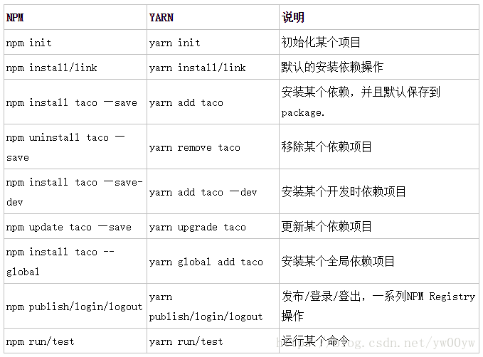

<!--
 * @Author: lcz
 * @Date: 2021-10-09 09:59:07
 * @LastEditTime: 2021-10-09 10:05:16
 * @LastEditors: Please set LastEditors
 * @Description: npm 与 yarn 的使用
 * @FilePath: \lcz_document\docs\baseuse\npmYarn.md
-->
## 1.快速删除
快速删除 node_modules
```js
  npm install rimraf -g
  rimraf node_modules
```

## 2.使用对比图
