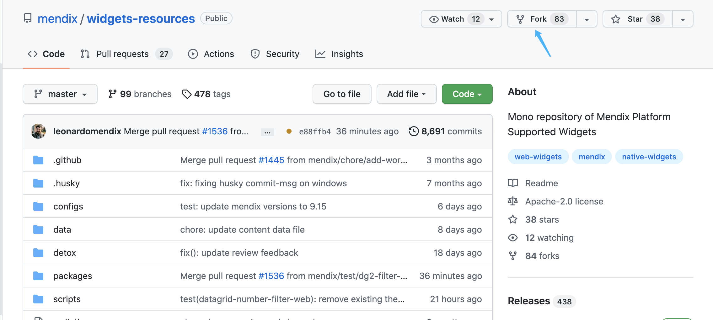
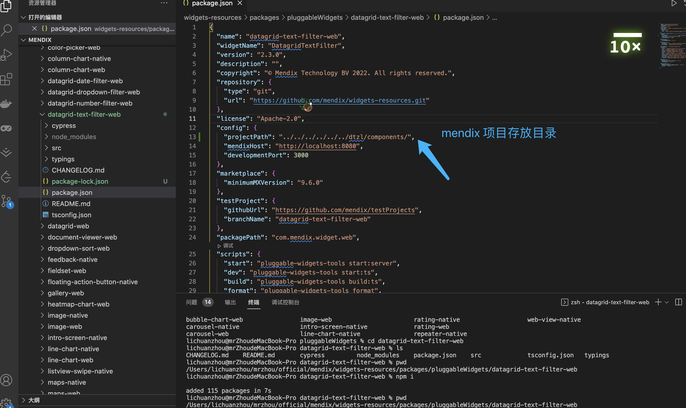
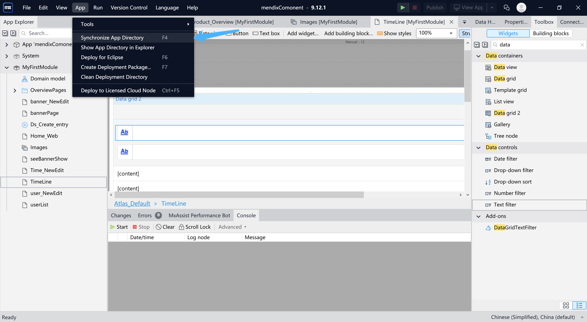

<!--
 * @Description: 
 * @Autor: lcz
 * @Date: 2022-07-12 17:17:47
 * @LastEditors: lcz
 * @LastEditTime: 2022-07-13 15:19:52
-->
### 官方github地址
[官方地址](https://github.com/mendix/widgets-resources)

### Fock代码到自己的github仓库

### 克隆fock项目
* 克隆刚刚到自己github的fock
* git clone xxxxx

### 安装node>16.x
* node-v 查看当前node是否版本号>16.x
> 没装node 或者装了node 但是版本号<16.x的处理方式
1. 直接node官网装>16
2. [nvm github地址](https://github.com/coreybutler/nvm-windows/releases)

### 安装lerna 多工程管理方式
[lerna 官方文档](https://lerna.js.org/docs/getting-started)
* npm i -g lerna
* lerna ls 项目查看多少工程
* lerna link 本地工程链接

### 进入fock项目的目录安装依赖
* 主包目录先npm i 目的是为了子包运行的时候找到主包的node_modules/.bin 运行
* 目录下 /widgets-resources/packages/pluggableWidgets/xxx
* npm i
> npm i 如果没有执行lerna link 会报错,找不到本地工具包

### 修改xxx widgets 的package.json 方便 打包后调试

### 修改widgets文件
* 修改小插件的主要功能

### 启动项目
* npm run start
* 会自动把修改完成后的widgets 插件放到mendix项目目录下

### mendix 更新小组件

### 运行mendix 查看效果