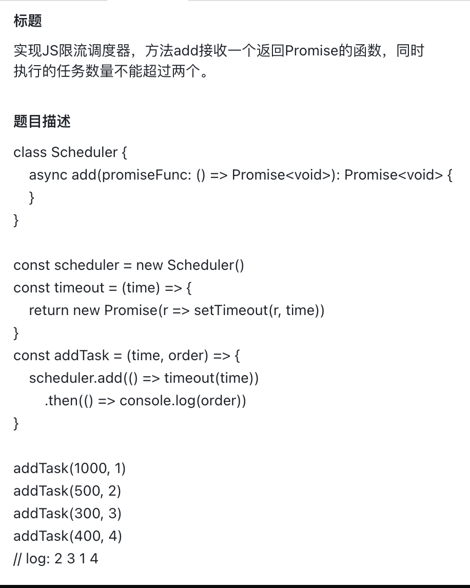

<!--
 * @Author: lcz
 * @Date: 2021-12-15 17:17:54
 * @LastEditTime: 2021-12-15 17:17:54
 * @LastEditors: Please set LastEditors
 * @Description: 打开koroFileHeader查看配置 进行设置: https://github.com/OBKoro1/koro1FileHeader/wiki/%E9%85%8D%E7%BD%AE
 * @FilePath: \lcz_document\docs\questions\despise2.md
-->

## 字节面试手写题



```js
class Scheduler {
  constructor(maxNum) {
    this.taskList = []
    this.count = 0
    this.maxNum = maxNum
  }
  async add(promiseCreator) {
    if (this.count >= this.maxNum) {
      await new Promise(resolve => {
        this.taskList.push(resolve)
      })
    }
    this.count++
    const result = await promiseCreator()
    this.count--
    if (this.taskList.length > 0) {
      this.taskList.shift()()
    }
    return result
  }
}
const scheduler = new Scheduler(2);
const timeout = (time)=>{
  return new Promise(r=>setTimeout(r,time))
}
const addTask = (time,order)=>{
  scheduler.add(()=>timeout(time)).then(()=>console.log(order))
}
addTask(1000,1)
addTask(500,2)
addTask(300,3)
addTask(400,4)
```