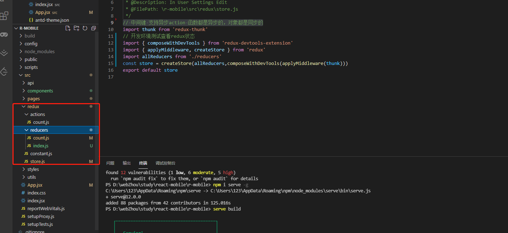

<!--
 * @Author: your name
 * @Date: 2021-05-16 20:20:26
 * @LastEditTime: 2021-07-09 17:07:59
 * @LastEditors: Please set LastEditors
 * @Description: In User Settings Edit
 * @FilePath: /lcz_document/docs/study/react.md
-->

## 1.打包后本地开启虚拟服务
```html
  //全局安装服务
  npm i serve -g
  //运行
  serve xxx
```
## 2.取消点击3秒延迟
 目录 public index.html
```html
  <script src="https://as.alipayobjects.com/g/component/fastclick/1.0.6/fastclick.js"></script>
  <script>
      if ('addEventListener' in document) {
        document.addEventListener('DOMContentLoaded', function() {
          FastClick.attach(document.body);
        }, false);
      }
      if(!window.Promise) {
        document.writeln('<script src="https://as.alipayobjects.com/g/component/es6-promise/3.2.2/es6-promise.min.js"'+'>'+'<'+'/'+'script>');
      }
  </script>
```
## 3.配置全局scss公共变量
config-overrides.js
```html
  const { override, adjustStyleLoaders   } = require("customize-cra");
  module.exports = override(
  // 配置全局scss引入
  adjustStyleLoaders(rule => {
    if (rule.test.toString().includes("scss")) {
      rule.use.push({
        loader: require.resolve("sass-resources-loader"),
        options: {
          resources: ["./src/styles/variable.scss","./src/styles/common.scss"]
        }
      });
    }
  })
);
```

## 4.antd-mobile 配置按需引入以及定制主题

```html
const { override, fixBabelImports , addLessLoader  } = require("customize-cra");
const theme = require('./antd-theme')
module.exports = override(
  //配置antd-mobile按需引入样式
  fixBabelImports("import", {
    libraryName: "antd-mobile",
    style: "css"
    // style: true //如果需要启动定制主题
  }),
  addLessLoader({
    javascriptEnabled: true,
    modifyVars: theme,
  }),
);

```
主题文档变量参考地址：https://github.com/ant-design/ant-design-mobile/blob/master/components/style/themes/default.less           
主题文件：antd-theme.json
```html
{
    "@color-text-base": "red",
    "@fill-base": "red",
    "@switch-fill": "yellow",
    "@switch-fill-android": "gary"
}
```

## 5.配置代理
src 目录下配置 setupProxy.js
```html
// http-proxy-middleware 脚手架中已自带 如果没有需要自行安装
const proxy = require('http-proxy-middleware');

module.exports = function(app){
    app.use(
        proxy('/api1',{
            target:'http://api.chuangyeyun.weixue.ltd',
            changeOrigin:true, //控制请求头中host字段的值
            pathRewrite:{'^/api1':''} //重新api路径 （必须）重写为空是服务器的的api路径的重写
        }),
        proxy('/api2',{
            target:'http://api.chuangyeyun.weixue.ltd',
            changeOrigin:true,
            pathRewrite:{'^/api2':''}
        })
    )
}
```

## 6.全局index.jsx 代码配置

```html
import React from 'react'
import ReactDOM from 'react-dom'
import './index.css' //重置样式
import App from './App'
// import reportWebVitals from "./reportWebVitals";
// React.StrictMode 检查App以及app子组件是否合理
import { BrowserRouter } from 'react-router-dom'
import store from './redux/store';
import { Provider } from 'react-redux'
ReactDOM.render(
  <Provider store={store}>
    <BrowserRouter>
      <App />
    </BrowserRouter>
  </Provider>,
  document.getElementById('root')
)
```

## 7.路由懒加载以及懒加载中页面显示的组件 以及Switch匹配到即不往下执行

```html
  import React, { Component ,lazy ,Suspense} from 'react'
  import { Route, Switch , Redirect} from 'react-router-dom'
  <!-- 加载组件 -->
  import ZLoading from './components/common/ZLoading/ZLoading'
  const Home = lazy(()=>import('./pages/home'))
  const About = lazy(()=>import('./pages/about'))
  export default class App extends Component {
  render() {
    return (
      <div className='App'>
        {/* 提高匹配速度，先匹配到后不执行 */}
        {/* replace堆替换 Link */}
        <Suspense fallback={<ZLoading/>}>
          <Switch>
            {/* 路由注册 exact 严格匹配 , */}
            <Route path='/home' component={Home}></Route>
            <Route path='/about' component={About}></Route>
            {/* 路由无匹配到重定向 */}
            <Redirect to="/home"></Redirect>
          </Switch>
        </Suspense>
      </div>
    )
  }
}
```
## 8.redux  redux-devtools-extension redux-thunk的使用
redux 状态管理工具                    
redux-devtools-extension 开发环境测试查看redux状态工具            
// 中间键 支持异步action 函数都是异步的，对象都是同步的               
文件目录结构           

store.js
```html
// 中间键 支持异步action 函数都是异步的，对象都是同步的
import thunk from 'redux-thunk'
// 开发环境测试查看redux状态
import { composeWithDevTools } from 'redux-devtools-extension'
import { applyMiddleware, createStore } from 'redux'
//所有注册的 reducers
import allReducers from './reducers'
const store = createStore(allReducers,composeWithDevTools(applyMiddleware(thunk)))
export default store
```
constant.js     
常量文件统一后期方便管理同一个字符串
```html
export const ADD = 'add';
export const REDUCE = 'reduce';
```
actions中的文件      
```html
import { ADD, REDUCE } from '../constant'
//同步action
export const createAddAction = data => ({type: ADD, data})
export const createReduceAction = data => ({type: REDUCE, data})

//异步action  异步action一般都会调用同步action
export const createAsyncAddAction = (data,time) => {
    return (dispatch)=>{
        setTimeout(()=>{
            dispatch(createAddAction(data))
        },time)
    }
}
```
reducers
index.js 用于导入全部的reduce进行注册
```html
import { combineReducers } from 'redux'

import count from './count.js'

// combineReducers 合并reducer
export default combineReducers({
    count
})

```

recudes状态管理组件
```html
import { ADD, REDUCE } from '../constant'
const number = 0
export default function countReducer(preState = number, action) {
  const { type, data } = action
  switch (type) {
    case ADD:
      return preState + data
    case REDUCE:
      return preState - data
    default:
      return preState
  }
}

```

页面中使用
```html
import { connect } from 'react-redux'
import { createAddAction, createReduceAction, createAsyncAddAction } from '../../redux/actions/count'
class Home extends PureComponent {
  add = () => {
    this.props.add(1)
  }
  reduce = () => {
    this.props.reduce(1)
  }
  asyncAdd = () => {
    this.props.addAsync(1, 1000)
  }

  render() {
    return (
      <Fragment>
        <div>number:{this.props.count}</div>
        <Button className='fs' onClick={this.add}>
          add
        </Button>
        <Button className='fs' onClick={this.reduce}>
          reduce
        </Button>
        <Button className='fs' onClick={this.asyncAdd}>
          异步加
        </Button>
      </Fragment>
    )
  }
}
<!-- 柯里化调用  前面为reduce 后面为UI组件 -->
export default connect(state => ({
  count: state.count,
}), {
  add: createAddAction,
  reduce: createReduceAction,
  addAsync: createAsyncAddAction,
})(Home)

```
拆分connent中的reduce

```html
const mapStateToProps = state => ({
  count: state.count,
})
const mapDispatchToProps = (dispatch, ownProps) => {
  return {
    add: (...args) => dispatch(createAddAction(...args)),
    reduce: (...args) => dispatch(createReduceAction(...args)),
    addAsync: (...args) => dispatch(createReduceAction(...args))
  }
}
```

## 9.hooks 的使用
hooks的使用是为了让函数式组件能像类组件一样 有生命周期  state变量 等           
基础用法
```html
import React from 'react'
export default function HooksTets() {
  const [count, setCount] = React.useState(0)
  const inputRef = React.useRef();
  const addCount = () => {
    setCount(count => count + 1)
  }
  const tips = ()=>{
      alert(inputRef.current.value)
  }
  /**
   * @description: 生命周期 hooks
   * @param {*}  function  [] 挂载 [count]挂载监听
   * @return {*} 卸载组件需要return 操作清楚定时器等
   */
  React.useEffect(() => {
    // return ()=>{
    // }
  }, [count])
  return (
    <div>
      <input type='text' ref={inputRef} />
      <div onClick={tips}>点我</div>
      <div>number:{count}</div>
      <div onClick={addCount}>hooksClick</div>
    </div>
  )
}
```

## 10.一般组件中使用路由 withRouter
```html
import { withRouter } from 'react-router-dom'
class ZHeader extends Component {
    back = ()=>{
        this.props.history.go(-1);
    }
    render() {
        return (
            <div>
                <Button type="primary" onClick={this.back}>返回上一页</Button>
            </div>
        )
    }
}
// withRouter 让一般组件支持路由组件
export default withRouter(ZHeader)
```

# 优化
## 1.PureComponent 的使用
快捷键rpc
PureComponent
优点：            
this.setState({})          
空值不会触发更新          
缺点是:          
push()        
unshift()       
等数组方法不会触发热更新，原因是引用类型，不是赋值             
```html
class Home extends PureComponent {
  
}
```

## 2.Fragment 优化
Fragment 相当于vue中的template                 
只接收一个参数key 用于diff            
优点是:页面中不会带有标签          

```html
<Fragment>
  页面中的元素
</Fragment>
```
另外一种实现方式空标签           
缺点：不能有任何的键值队，否则无效
```html
<>
</>
```
## 3.ZNavLink 组件封装
封装
```html
  import React, { Component } from 'react'
  import { NavLink } from 'react-router-dom'
  import './index.scss'
  export default class ZNavLink extends Component {
      render() {
          return (
              <div>
              <!-- ...this.props结构所有传递进来的值  -->
                  <NavLink activeClassName="active" className="headerItem" {...this.props}/>
              </div>
          )
      }
  }

```
使用
```html
  <ZNavLink to="/home" children="首页"/>
```