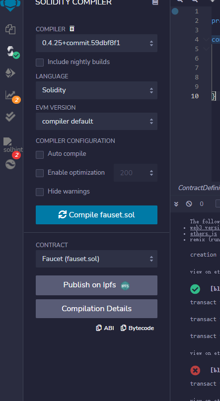
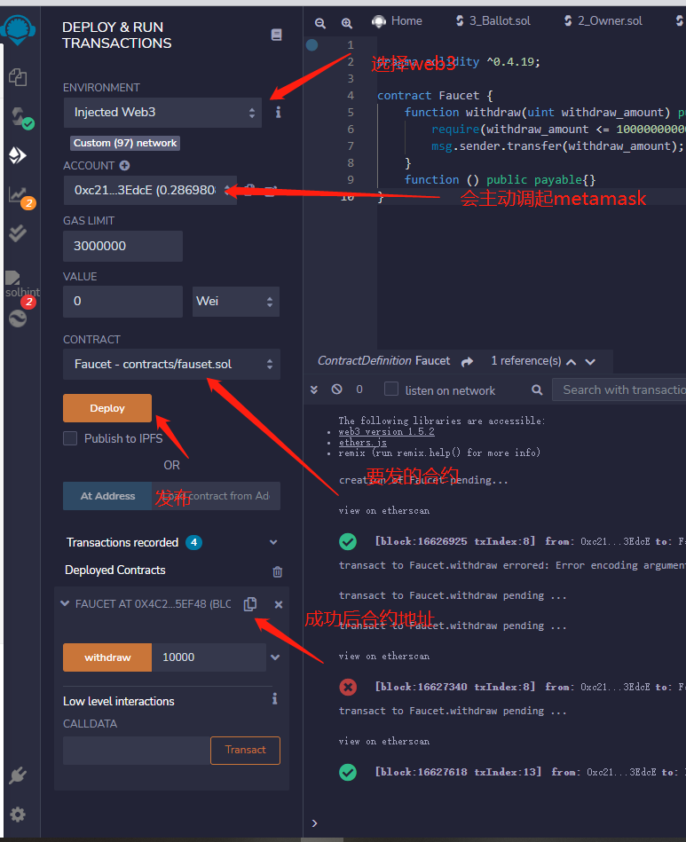

<!--
 * @Author: your name
 * @Date: 2022-02-10 16:35:55
 * @LastEditTime: 2022-02-10 16:42:11
 * @LastEditors: Please set LastEditors
 * @Description: 打开koroFileHeader查看配置 进行设置: https://github.com/OBKoro1/koro1FileHeader/wiki/%E9%85%8D%E7%BD%AE
 * @FilePath: \lcz_document\docs\study\solidy.md
-->
## 1.http://remix.ethereum.org/ remix 编写合约
```jsx
pragma solidity ^0.4.19;

contract Faucet {
    function withdraw(uint withdraw_amount) public {
        require(withdraw_amount <= 100000000000000000);
        msg.sender.transfer(withdraw_amount);
    }
    // 什么参数都没设置的时候的回调
    function () public payable{}
}
```

## 版本注意
^0.4.19
设置版本


## 设置web3的发布 会主动调起metamask授权获得币 发布合约
         

上图withdraw 转钱需要合约地址有币支付gas费用才可成功                       

bsc 测试链 查询地址                     
https://testnet.bscscan.com/address/0x4c2F07e52380743684DA42fD833522709eC5EF48